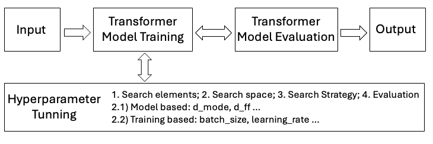
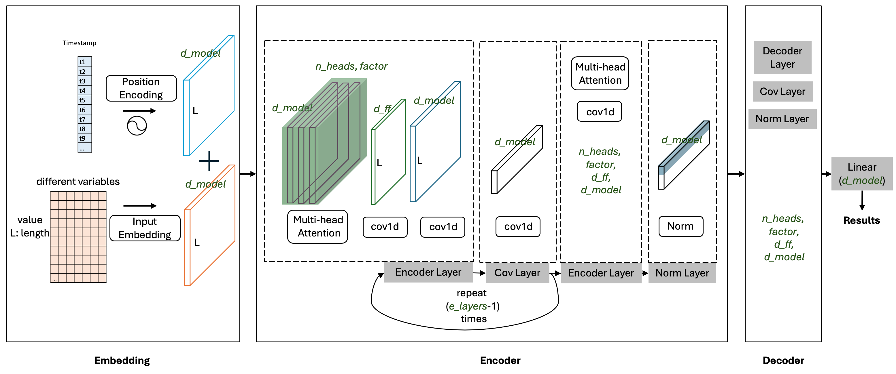

This is the official code of the paper "A Unified Hyperparameter Optimization Pipeline for Transformer-Based Time Series Forecasting Models"

<!--  -->
<!--  -->
<!--  -->
# How to Run
## 0. Prepare 
### Datasets
[Google Drive](https://drive.google.com/drive/folders/13Cg1KYOlzM5C7K8gK8NfC-F3EYxkM3D2)

You can check the details of dataset from [Time-Series-Library](https://github.com/thuml/Time-Series-Library/tree/main)

### Key
Add your wandb key to the line ```wandb.login(key='your key')``` at the file ~/exp/exp_long_term_forecasting_ray_tune.py

## 1. Set the Environment 
```bash
# clone code
git clone https://github.com/jingjing-unilu/HPO_transformer_time_series.git
# create conda enviroment
conda create -n time_hyperS_0909 python=3.8
conda activate time_hyperS_0909
cd /your/path/to/HPO_transformer_time_series

# install necessary libraries
pip install -r requirements.txt
pip install scikit-learn==1.2
pip install pandas
pip install matplotlib
pip install jupyter
pip install eco2ai
pip install "ray[tune]"
pip install optuna
pip install torchvision #for testing
pip install wandb
pip install mamba_ssm

# exit the env after finishing
conda deactivate
```
## 2. Quick Simple Test
```bash
conda activate time_hyperS_0909
bash ./scripts/long_term_forecast_hyperS/ETT_script/PatchTST_ETTh1.sh > ./log_20240909/ETT_script_PatchTST_ETTh1
conda deactivate
``` 

## 3. Run All Experiments
```bash
nohup ./scripts/long_term_forecast_hyperS/0_all_experiments_1.sh > log0 &
``` 

## 4. Some Results
### 4.0 Best Model & Loss
#### 4.0.0 ETTh1 dataset
<iframe src="https://api.wandb.ai/links/jingjing_unilu-university-of-luxembourg/1vyla5qc" style="border:none;height:1024px;width:100%"></iframe>

#### 4.0.1 Weather dataset
<iframe src="https://api.wandb.ai/links/jingjing_unilu-university-of-luxembourg/qmgok20k" style="border:none;height:1024px;width:100%"></iframe>

#### 4.0.1 ECL dataset
<iframe src="https://api.wandb.ai/links/jingjing_unilu-university-of-luxembourg/uv9kf6yp" style="border:none;height:1024px;width:100%"></iframe>

### 4.1 Parallel Coordinates Chart
#### 4.1.0 Weather dataset
<iframe src="https://api.wandb.ai/links/jingjing_unilu-university-of-luxembourg/wo74wre6" style="border:none;height:1024px;width:100%"></iframe>

#### 4.1.1 ETTh1 dataset
<iframe src="https://api.wandb.ai/links/jingjing_unilu-university-of-luxembourg/8q7ede82" style="border:none;height:1024px;width:100%"></iframe>

## Figures in Paper
<figure>
<p align="center" width="100">
  
  <figcaption><align="center">Fig.1 - HPO pipeline for Transformer-based forecasting.</figcaption>
  </p>
</figure>

<figure>
<p align="center" width="100%">
  
  <figcaption><align="center">Fig.2 - Common Parameters.</figcaption>
  </p>
</figure>


## Citation
If you find this repo useful, please cite our paper.
```
@misc{xu2025unifiedhyperparameteroptimizationpipeline,
      title={A Unified Hyperparameter Optimization Pipeline for Transformer-Based Time Series Forecasting Models}, 
      author={Jingjing Xu, Caesar Wu, Yuan-Fang Li, Grégoire Danoy, Pascal Bouvry},
      year={2025},
      eprint={2501.01394},
      archivePrefix={arXiv},
      primaryClass={cs.LG},
      url={https://arxiv.org/abs/2501.01394}, 
}
```
## Acknowledgement
This project is supported by the Luxembourg National Research Fund (Fonds National de la Recherche - FNR), Grant ID: 15748747 and Grant ID: C21/IS/16221483/CBD.

The code is constructed based on the following repos: 
https://github.com/thuml/Time-Series-Library/tree/main

## Useful Refrences:
    https://pytorch.org/tutorials/beginner/hyperparameter_tuning_tutorial.html
    https://docs.ray.io/en/latest/tune/index.html
    https://docs.ray.io/en/latest/tune/examples/tune-pytorch-cifar.html#tune-pytorch-cifar-ref

